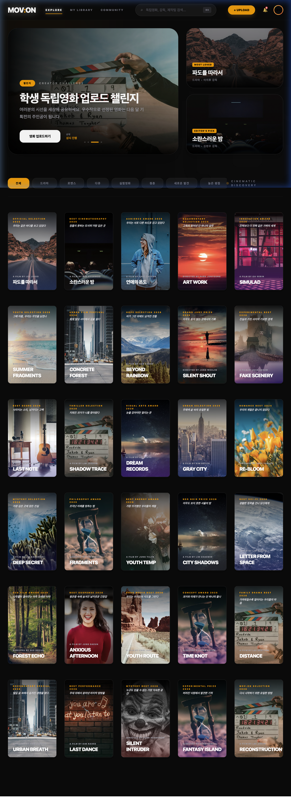

# MOV:ON 🎬

> 독립영화 창작자와 관객을 잇는 시네마틱 플랫폼

MOV:ON은 신진 독립영화 감독들이 작품을 업로드하고, 관객으로부터 타임스탬프 기반 실시간 피드백을 받을 수 있는 플랫폼입니다. AI 분석 리포트, 크리에이터 대시보드, 커뮤니티 기능을 제공합니다.



---

## ✨ 주요 기능

- **Explore** — 독립영화 탐색, 카테고리 필터, 영화 상세 모달
- **Watch Page** — 영상 시청 + 타임스탬프 기반 관객 피드백
- **Creator Dashboard** — 업로드 작품 관리, AI 분석 리포트, 감성 타임라인
- **My Library** — 북마크, 업로드 목록, 최근 활동
- **Community** — 공지사항 / 자유게시판 / 제작 팁 / 구인구직 카테고리 게시판
- **Upload** — 포스터·트레일러·본편 업로드 + 실시간 카드 미리보기
- **알림 센터** — 피드백·좋아요·이벤트 알림 드롭다운

---

## 🛠 기술 스택

| 영역 | 기술 |
|------|------|
| 프레임워크 | React 19 + Vite |
| 스타일링 | Tailwind CSS v4 |
| 라우팅 | React Router DOM v7 |
| 차트 | Recharts |
| 아키텍처 | Atomic Design (atoms / molecules / organisms) |

---

## 🚀 로컬 실행 방법

### 사전 준비

- [Node.js](https://nodejs.org/) **v18 이상** 설치 필요
- npm v9 이상 (Node.js 설치 시 포함)

### 1. 레포지토리 클론

```bash
git clone https://github.com/speter0601/2026KHUTHON.git
cd 2026KHUTHON
```

### 2. 프론트엔드 디렉토리로 이동

```bash
cd Khuthon_Front
```

### 3. 의존성 설치

```bash
npm install
```

### 4. 개발 서버 실행

```bash
npm run dev
```

브라우저에서 **[http://localhost:5173](http://localhost:5173)** 접속 🎉

> 포트가 이미 사용 중이라면 Vite가 자동으로 5174, 5175 등 다른 포트를 시도합니다.

---

## 📁 프로젝트 구조

```
Khuthon_Front/
├── public/
├── src/
│   ├── assets/
│   ├── components/
│   │   ├── atoms/          # 기본 UI 요소 (Button, Title 등)
│   │   ├── molecules/      # 복합 컴포넌트 (MovieCard, LibraryCard 등)
│   │   └── organisms/      # 섹션 단위 컴포넌트 (Header, EventHeroCarousel 등)
│   ├── data/               # 더미 데이터 (movies.js, events.js)
│   ├── layouts/            # 페이지 레이아웃
│   ├── pages/              # 라우트별 페이지 컴포넌트
│   │   ├── HomePage.jsx
│   │   ├── WatchPage.jsx
│   │   ├── CreatorDashboardPage.jsx
│   │   ├── UserMyPage.jsx
│   │   ├── CommunityPage.jsx
│   │   ├── UploadPage.jsx
│   │   └── ...
│   ├── router/             # React Router 설정
│   ├── App.jsx
│   ├── main.jsx
│   └── index.css
├── package.json
└── vite.config.js
```

---

## 📦 빌드 (프로덕션)

```bash
npm run build
```

빌드 결과물은 `dist/` 폴더에 생성됩니다.

로컬에서 빌드 결과를 미리보려면:

```bash
npm run preview
```

---

## 👤 개발자

| 이름 | 역할 |
|------|------|
| 신연호 | 프론트엔드 개발 |

---

## 📝 라이선스

본 프로젝트는 2026 KHUTHON 해커톤 출품작입니다.
